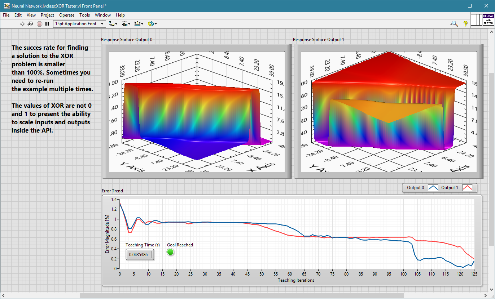
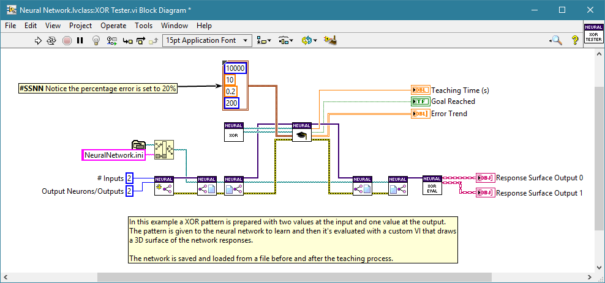
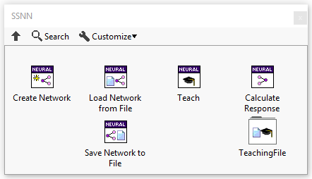

# Simple Neural Network
A simple LabVIEW implementation of back propagation neural network with RPROP algorithm.

# Description
This toolkit is designed to be used for super simple neural network use cases. It is not designed for any advanced AI applications but should be used as a starting point, evaluation or proof of concept for further development.

The only teaching algorithm supported is RProp because of it's independence from the settings and universality.

The features of the toolkit:
- feed-forward neural network with sigmoidal unipolar activation function
- automatic linear scaling of inputs and outputs to the linear range of the neurons for optimum performance
- option to enable last layer linear activation function
- BIAS inputs for each layer for optimum performance
- two hidden layers with automatic number of neurons
- RProp teaching algorithm
- teaching in chunks from a human readable TDMS file
- evaluating errors over validation set
- percentage error evaluation on each output
- saving and loading the network from human readable file
- documentation
- XOR tester

NOTE - this is a super simple neural network and it should be used only in simple cases :slightly_smiling_face:

THE CODE IS OPEN so you can use it to learn how Neural Nets work or modify it to your needs.

# Release Notes
- changed the structure of NN when saved to file. It is now saved to an INI file and can be easily edited.
- changed the teaching file to be TDMS based. This will make it easier to create and view files.
- simplified the API and made it even faster to use

